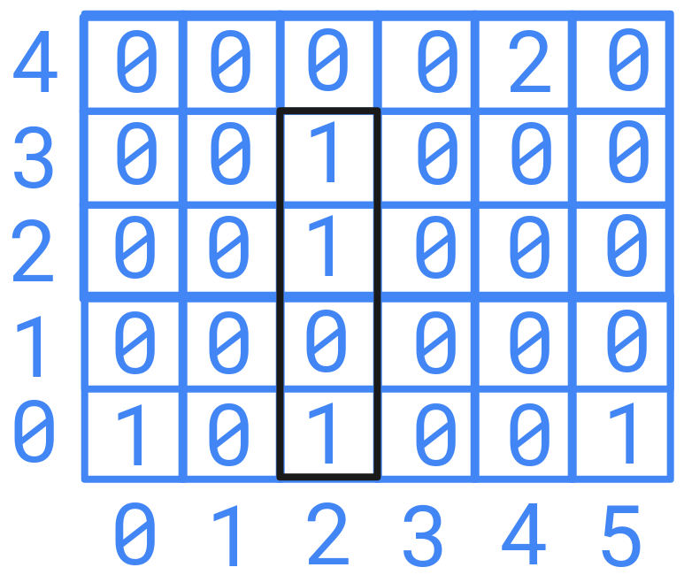
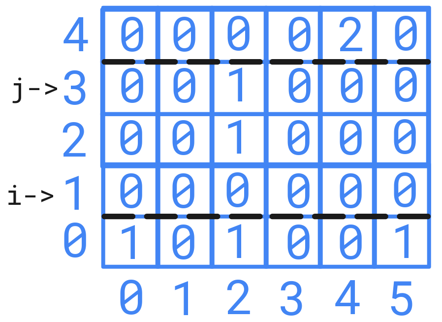
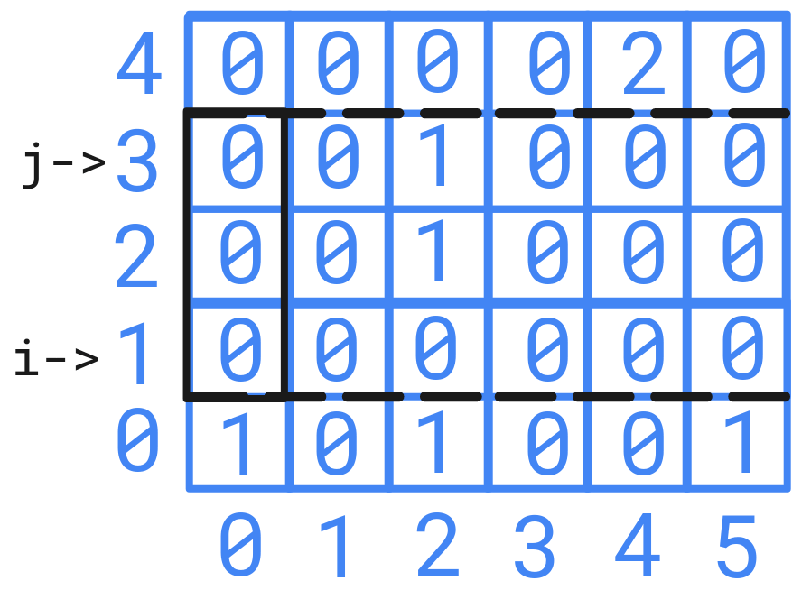

Let's increase problem level further.

### Problem

Given a grid of integers **L = [[A<sub>1,1</sub>, A<sub>1,2</sub>, A<sub>1,3</sub>, ..., A<sub>1,M</sub>], [A<sub>2,1</sub>, A<sub>2,1</sub>, A<sub>2,3</sub>, ..., A<sub>2,M</sub>], [A<sub>3,1</sub>, A<sub>3,2</sub>, A<sub>3,3</sub>, ..., A<sub>3,M</sub>], [..., ..., ..., ..., ...], [A<sub>N,1</sub>, A<sub>N,2</sub>, A<sub>N,3</sub>, ..., A<sub>N,M</sub>]]**. Where **A<sub>i,j</sub> ≥ 0**, **0 ≤ i ≤ N**, **0 ≤ j ≤ M**. You have to find the least perimeter of rectangle which adds up to a given integer **K**.
	
For example, 
If  **L = [[1, 0, 0, 0, 0], [0, 0, 0, 0, 0], [1, 0, 1, 1, 0], [0, 0, 0, 0, 0], [0, 0, 0, 0, 2], [1, 0, 0, 0, 0]]** and **K = 3**, the answer would be **22**, rectangles will be **{(2, 3), (4, 4)}**.



### Solution

The first approach that comes to mind is calculating 2D prefix sum, and then finding the least perimeter rectangular field adding up to **K**.
Calculating 2D prefix sum will take $\cal{O}(N \cdot M)$ time. But, if we find rectangle adding up to **K** by taking every possible rectangle then it will take $\cal{O}(X)$ time, where **X = Number of possible rectangles**. Let's calculate **X**. We will choose two indices of length, and two vertices of width, which will form a rectangle. Number of ways to choose two indices of length is $N \choose 2$ and of width is $M \choose 2$.

$$
X = {N \choose 2} \cdot {M \choose 2}
$$
$$
= \frac{N\cdot(N+1)}{2} \cdot \frac{M\cdot(M+1)}{2}
$$
$$
= \frac{(N^2 + N)\cdot(M^2 + M)}{4}
$$  

$$
X = \frac{N^2 \cdot M^2+N^2 \cdot M+M^2 \cdot N+M \cdot N}{4}
$$

We can see that overall time complexity is $\cal{O}(N^2 \cdot M^2).$ Can we optimize it? ... Yes, by using sliding window algorithm on 2D array. But, how we will apply sliding window algorithm on a 2D array?

For using sliding window algorithm, we have chosen two indices from either row or column as shown below and apply sliding window with fixed row or column. 



Using sliding window for a fixed rows or columns will take $\cal{O}(N)$ or $\cal{O}(M)$ time complexity accordingly. As we have to repeat it for others fixed rows or columns also. Which will result in $\cal{O}(N \cdot M^2)$ or $\cal{O}(M \cdot N^2)$ time complexity.



### Code

```cpp
#include <bits/stdc++.h>
using namespace std;

#define INF INT_MAX

pair<int,int> ans[2];

void slidingWindow(vector<vector<int>>& l, int n, int m, int k){
    int st = -1,en = -1,perimeter = INF;
    vector<vector<int>> prefixL(n+1,vector<int>(m+1));
    for(int i=0;i<=n;i++)   prefixL[i][0] = 0;
    for(int j=0;j<=m;j++)   prefixL[0][j] = 0;
    for(int i=1;i<=n;i++)
        for(int j=1;j<=m;j++)
            prefixL[i][j] = (l[i-1][j-1] + prefixL[i-1][j] + prefixL[i][j-1] - prefixL[i-1][j-1]);
    for(int i=0;i<n;i++){
        for(int j=i;j<n;j++){
            st = 0;en = 0;
            int cnt = prefixL[j+1][1] - prefixL[j+1][0] - prefixL[i][1] + prefixL[i][0];
            for(;k<m;){
                if(cnt > k){
                    if(st == en){   st++;en++;}
                    else            st++;
                }else if(cnt < k){
                    en++;
                }else{
                    while(prefixL[j+1][st+1] - prefixL[j+1][st] - prefixL[i][st+1] + prefixL[i][st] == 0)
                        st++;
                    if(perimeter > 2*((j-i+1)+(en-st+1))){
                        perimeter = 2*((j-i+1)+(en-st+1));
                        ans[0].first = i;ans[0].second = st;
                        ans[1].first = j;ans[0].second = en;
                    }
                    en++;
                }
                if(en == m) break;
                cnt = prefixL[j+1][en+1] - prefixL[j+1][st] - prefixL[i][en+1] + prefixL[i][st];
            }
        }
    }
}

int main() {
    int n,m,k;
    cin >> n >> m >> k;
    vector<vector<int>> l(n,vector<int>(m));
    for(int i=0;i<n;i++)
        for(int j=0;j<m;j++)
            cin >> l[i][j];
    slidingWindow(l,n,m,k);
    cout << ans[0].first << " " << ans[0].second << endl
         << ans[1].first << " " << ans[1].second;
}
```

## Problem : IOI, Garden, 2005

### Question summary:

A rose garden in rectangular form is **l** meters long and **w** meters wide. We have to fence two rectangular fences inside the garden such that both are disjoint and the sum of their perimeter is minimal. So, we have to just output the sum of perimeter of those rectangles.

### Solution

We will divide the rectangle vertically and find both side rectangle with minimum perimeter. Doing this will ensure that rectangles are disjoint. Repeat the process now by dividing the rectangle horizontally. We have already discussed the process to find the rectangles with sum equals to **K**. So, how exactly we are going to find the minimum perimeter rectangle within the range?

To find the minimum perimeter rectangle in the range, we will have to take four arrays, two of size **N** (for rows) and two of size **M** (for columns).

### Code

```cpp
#include <bits/stdc++.h>
using namespace std;

#define INF 10000000

int slidingWindow(vector<vector<int>>& roseGarden, int n, int m, int k){
    int st = -1,en = -1,perimeter = INF;
    vector<vector<int>> prefixL(n+1,vector<int>(m+1));
    vector<int> rowSt(n, INF), rowEn(n, INF), colSt(m, INF), colEn(m, INF);
    for(int i=0;i<=n;i++)   prefixL[i][0] = 0;
    for(int j=0;j<=m;j++)   prefixL[0][j] = 0;
    for(int i=1;i<=n;i++)
        for(int j=1;j<=m;j++)
            prefixL[i][j] = (roseGarden[i-1][j-1] + prefixL[i-1][j] + prefixL[i][j-1] - prefixL[i-1][j-1]);
    for(int i=0;i<n;i++){
        for(int j=i;j<n;j++){
            st = 0;en = 0;
            int cnt = prefixL[j+1][1] - prefixL[j+1][0] - prefixL[i][1] + prefixL[i][0];
            for(;en < m;){
                if(cnt > k){
                    if(st == en){   st++;en++;}
                    else            st++;
                }else if(cnt < k){
                    en++;
                }else{
                    while(st < en && ((prefixL[j+1][st+1] + prefixL[i][st]) == (prefixL[j+1][st] + prefixL[i][st+1])))
                        st++;
                    perimeter = 2*((j-i+1)+(en-st+1));
                    rowSt[j] = min(rowSt[j], perimeter);
                    rowEn[i] = min(rowEn[i], perimeter);
                    colSt[en] = min(colSt[en], perimeter);
                    colEn[st] = min(colEn[st], perimeter);
                    en++;
                }
                if(en >= m) break;
                cnt = (prefixL[j+1][en+1] + prefixL[i][st]) - (prefixL[j+1][st] + prefixL[i][en+1]);
            }
        }
    }
    for(int i=1;i<n;i++)
        rowSt[i] = min(rowSt[i], rowSt[i-1]);
    for(int i=n-2;i>=0;i--)
        rowEn[i] = min(rowEn[i], rowEn[i+1]);
    for(int j=1;j<m;j++)
        colSt[j] = min(colSt[j], colSt[j-1]);
    for(int j=m-2;j>=0;j--)
        colEn[j] = min(colEn[j], colEn[j+1]);
    int ans = INF;
    for(int i=1;i<n;i++)
        ans = min(ans, rowSt[i-1] + rowEn[i]);
    for(int j=1;j<m;j++)
        ans = min(ans, colSt[j-1] + colEn[j]);
    return ans;
}

int main() {
    int l,w,n,k;
    cin >> l >> w
        >> n >> k;
    vector<vector<int>> roseGarden(l,vector<int>(w, 0));
    int x,y;
    while(n--){
        cin >> x >> y;
        x--;y--;
        roseGarden[x][y]++;
    }
    int ans = slidingWindow(roseGarden,l,w,k);
    if(ans == INF)  cout << "NO\n";
    else            cout << ans;
    return 0;
}
```